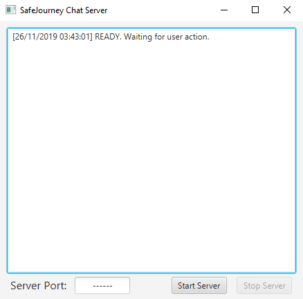
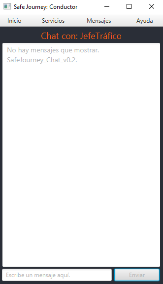

# SafeJourney's Chat Client Development

Server and Client branches will merge here.

## Server

- Operates independently.
- It is meant to be running indefinetly.
- Authenticates clients.
- Stores messages sent to unreachable destinations.
- Hosted locally.
- Allows for parallel servers running on different ports under the same ip.

## Clients

- SupervisorChatClient: Able to message between multiple Drivers.
- DriverChatClient: Can only chat with his supervisor.

## Additonal Info

#### Messaging without server.
- Clients only work when a server is running on the assigned socket.

#### Offline chat partner.
- If the Server doesn't find the destination Client it will create a file to store the messages.

#### Offline recieved messages.
- Upon connecting to the Server this will check if there is a existing file with the Client as destinatary. In case a file with messages for the client exists messages will be sent and the file will be deleted.

## UID Information

#### Server

#### Client
- Supervisor

WORK IN PROGRESS

- Driver

# Changelog

- Basic server created.
- Basic client created.

